# BOOK.md

## Title

Tiny AI Programs

Subtitle:  
Understand Modern AI with Diagrams and Tiny Python Scripts

---

## Book Philosophy

Modern AI systems often look complicated.

But most breakthroughs hide simple ideas.

This book reveals those ideas through **tiny runnable programs and clear diagrams**.

It does not focus on research papers.  
It does not derive equations.  
It does not teach frameworks.

Instead, each chapter contains:

- a simple diagram explaining the idea
- a tiny runnable Python program
- a walkthrough of how the system works
- experiments the reader can run

Understanding emerges by **seeing the system and running it**.

The guiding principle:

diagram → tiny program → run it → observe behavior

---

## Design Principles

### Code

Every program in this book follows strict rules:

- single file
- small enough to read in one sitting
- minimal dependencies
- fully runnable
- trains or demonstrates a real behavior

The scripts are intentionally tiny so readers can understand the entire system.

### Diagrams

This book is highly visual.

Every chapter contains multiple diagrams that explain:

- data flow
- system architecture
- training loops
- internal representations

Diagrams are used instead of math derivations.

---

## Chapter Structure

Each chapter follows the same structure.

### 1. The Idea

A short explanation of the concept in plain language.

### 2. System Diagram

A visual explanation of how information flows through the system.

### 3. The Tiny Program

A small runnable script implementing the idea.

### 4. Walking Through the System

Explanation of the key parts of the program.

### 5. Run the Experiment

Instructions for running the script and observing the behavior.

### 6. What Emerges

Discussion of what the program learns or produces.

---

## Part I — Learning From Data

### Chapter 1 — Fitting Data

Goal: show how a model can fit simple data.

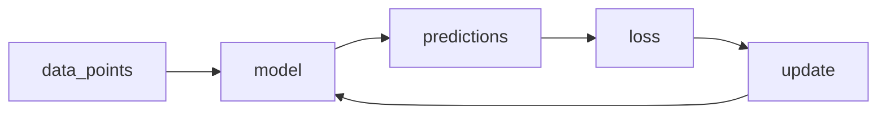

Concepts introduced:

-   prediction
    
-   loss
    
-   iterative improvement
    

----------

### Chapter 2 — Classification

Goal: separate categories of data.

Diagram

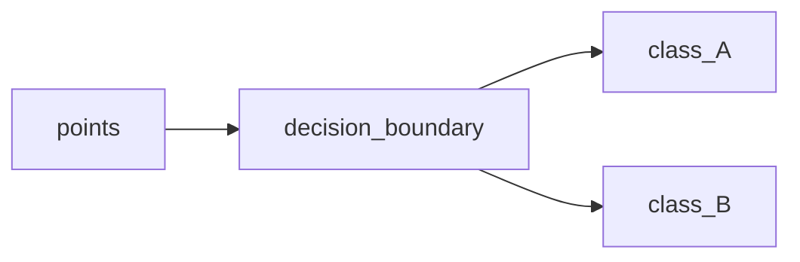

Concepts introduced:

-   decision boundary
    
-   probability
    
-   classification
    

----------

### Chapter 3 — Similarity

Goal: classify data using similarity.

Diagram

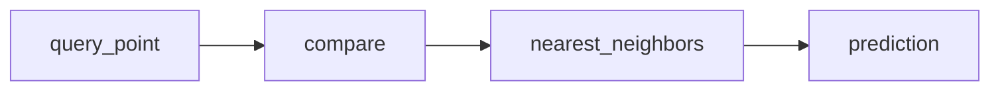

Concepts introduced:

-   distance
    
-   similarity
    
-   example-based learning
    

----------

### Chapter 4 — Clustering

Goal: discover structure without labels.

Diagram

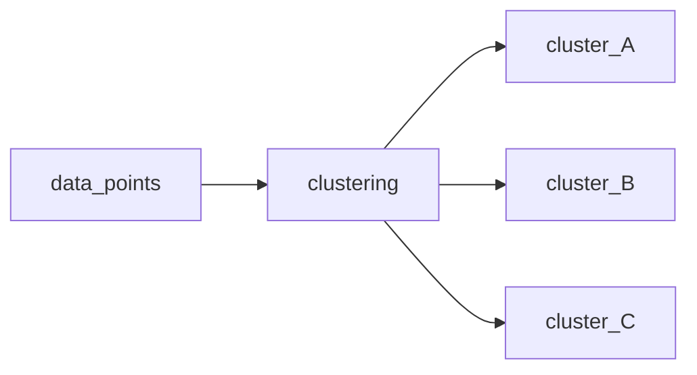

Concepts introduced:

-   grouping
    
-   unsupervised learning
    
-   cluster centers
    

----------

## Part II — Neural Networks

### Chapter 5 — The Perceptron

Goal: build the simplest neural unit.

Diagram

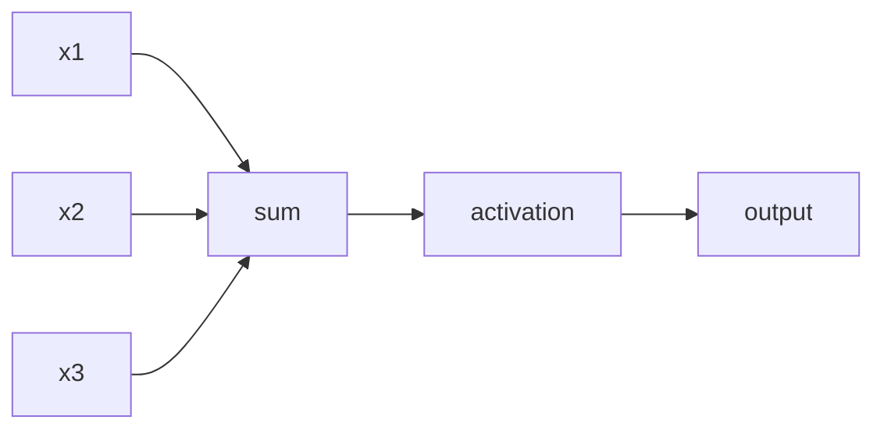

Concepts introduced:

-   weighted inputs
    
-   activation functions
    

----------

### Chapter 6 — Multi-Layer Networks

Goal: stack layers to learn complex patterns.

Diagram

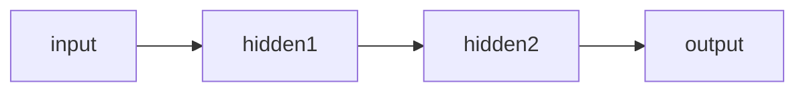

Concepts introduced:

-   hidden layers
    
-   nonlinear transformations
    

----------

### Chapter 7 — Representation Learning

Goal: compress information into useful representations.

Diagram

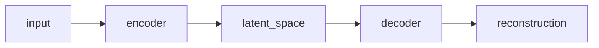

Concepts introduced:

-   latent representation
    
-   reconstruction
    

----------

### Chapter 8 — Embeddings

Goal: represent concepts as vectors.

Diagram

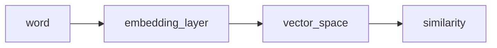

Concepts introduced:

-   embedding space
    
-   semantic similarity
    

----------

## Part III — Deep Learning Systems

### Chapter 9 — Convolutions

Goal: detect patterns in images.

Diagram

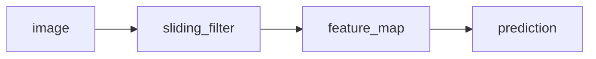

Concepts introduced:

-   filters
    
-   feature maps
    
-   local patterns
    

----------

### Chapter 10 — Residual Connections

Goal: allow deep networks to train effectively.

Diagram

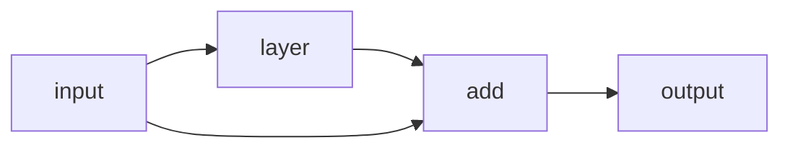

Concepts introduced:

-   skip connections
    
-   residual learning
    

----------

### Chapter 11 — Generative Models

Goal: generate realistic samples.

Diagram

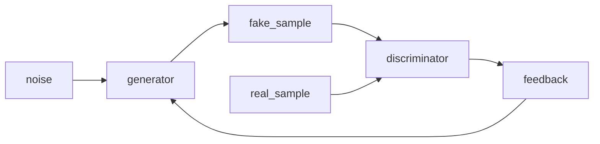

Concepts introduced:

-   adversarial learning
    
-   generative models
    

----------

### Chapter 12 — Latent Spaces

Goal: generate data from compressed representations.

Diagram

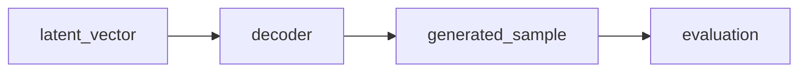

Concepts introduced:

-   latent space
    
-   generative decoding
    

----------

## Part IV — Attention

### Chapter 13 — Attention

Goal: allow elements to focus on relevant information.

Diagram

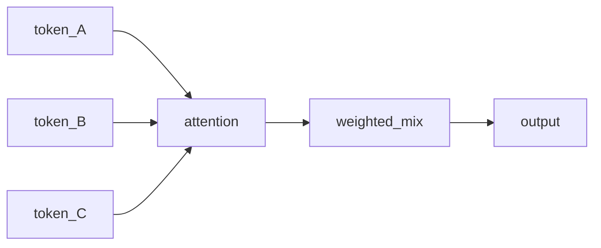

Concepts introduced:

-   information weighting
    
-   contextual relationships
    

----------

### Chapter 14 — Transformer Blocks

Goal: process sequences using attention layers.

Diagram

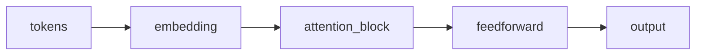

Concepts introduced:

-   self-attention
    
-   transformer blocks
    

----------

### Chapter 15 — Language Models

Goal: predict the next element in a sequence.

Diagram

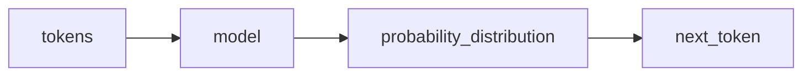

Concepts introduced:

-   sequence modeling
    
-   next-token prediction
    

----------

### Chapter 16 — Diffusion

Goal: generate data by reversing noise.

Diagram

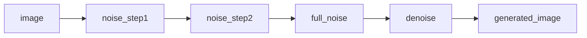

Concepts introduced:

-   noise processes
    
-   iterative denoising
    

----------

## Part V — Modern AI Systems

### Chapter 17 — Retrieval

Goal: combine models with external knowledge.

Diagram

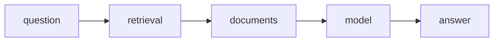

Concepts introduced:

-   memory
    
-   retrieval systems
    

----------

### Chapter 18 — Parameter Efficient Training

Goal: adapt models with minimal changes.

Diagram

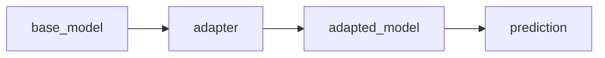

Concepts introduced:

-   efficient updates
    
-   lightweight adaptation
    

----------

### Chapter 19 — Learning From Rewards

Goal: learn behavior using feedback.

Diagram

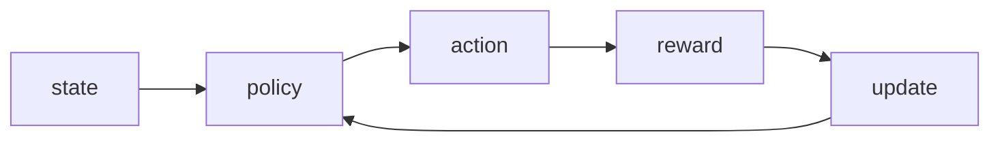

Concepts introduced:

-   reinforcement learning
    
-   reward feedback
    

----------

### Chapter 20 — Alignment

Goal: guide models toward desired behavior.

Diagram

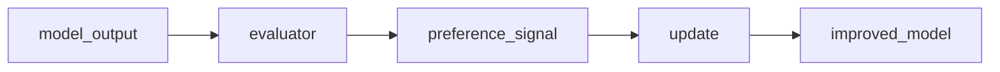

Concepts introduced:

-   preference learning
    
-   alignment
    

----------

## Diagram Density

Each chapter includes multiple diagrams explaining different aspects of the system.

Typical diagrams include:

-   architecture diagrams
    
-   training loops
    
-   information flow
    
-   vector spaces
    
-   interaction systems
    

The goal is to make the mechanisms visible.

----------

## Audience

This book is designed for:

-   engineers curious about how AI works
    
-   students learning machine learning systems
    
-   developers using AI who want to understand the internals
    

It assumes only basic programming knowledge.

----------

## Closing Idea

Modern AI is not magic.

It is a collection of surprisingly simple systems working together.

Once you see the systems clearly and run them yourself, the mystery disappears.